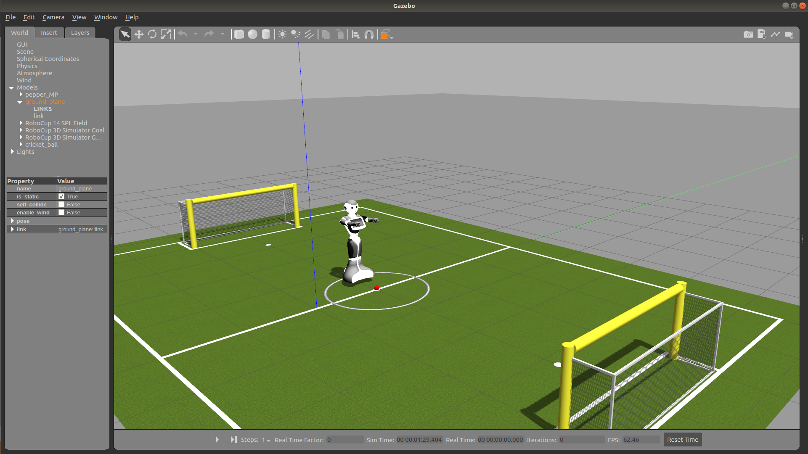
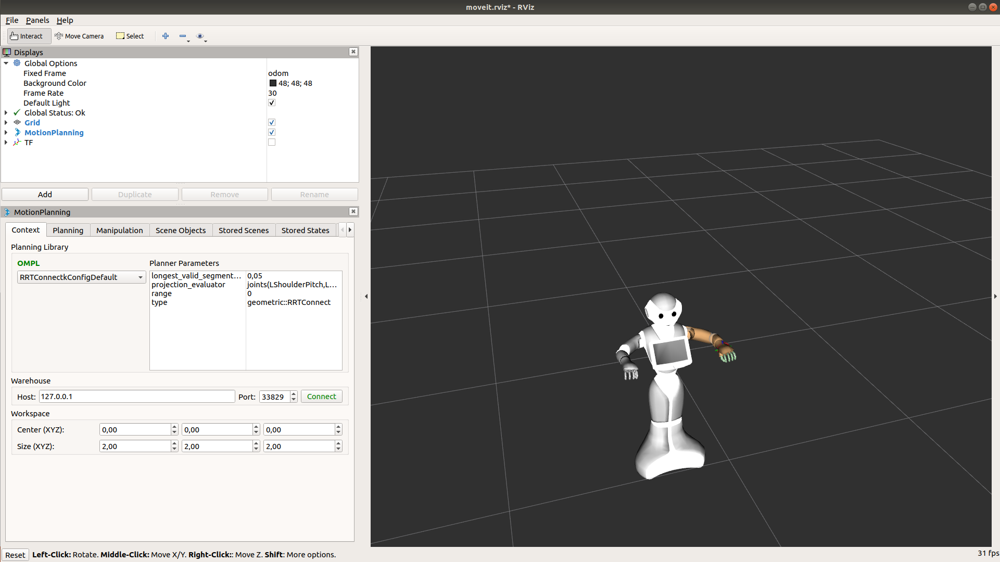

# What is this?

Template repository to quickly get a simulated pepper environment up and running. This is not straight forward, because most pepper related ROS packages are only available for ROS kinetic, which is not supported on Ubuntu 18.04. Hence, we have to compile everything from source, which is essentially why the small shell script in `/pepper_ws/src/` does.

# Installation
**IMPORTANT**: Requires ROS melodic to be installed on your system. Follow installation instructions <a href="http://wiki.ros.org/melodic/Installation/Ubuntu" target="_blank">here</a>

1. Clone this repo: `git clone https://github.com/frietz58/pepper_sim.git`
2. Change working dir: `cd pepper_sim/pepper_ws/src/`
3. Run installation script: `bash ./pepper_moveit_setup.sh`
4. During the installation, you will be have to accept the licence of that ships the pepper meshes, and enter installation path. **Accept the default path by hitting `Enter`**, otherwise RVIZ etc might not find the meshes and won't be able to display your model of the pepper robot.

The last step installs the fundamental packages (that are in theory only available for ROS kinetic), including the meshes for a model of the pepper robot, compiles everything and sources `devel/setup.bash` 

If everything worked you can execute the below commands to either get started with RVIZ and ROS Moveit or Gazebo.

## Gazebo
To start Gazebo with pepper on a robocup field, paste the following command into your terminal. 
```bash
roslaunch pepper_gazebo_plugin pepper_gazebo_plugin_Y20.launch
```
You should see something like this:
</img>

## RVIZ + MoveIt
To launch RVIZ and MoveIt to generate complex trajectories run:
```bash
roslaunch pepper_moveit_config demo.launch
```
You should see something like this:
</img>
